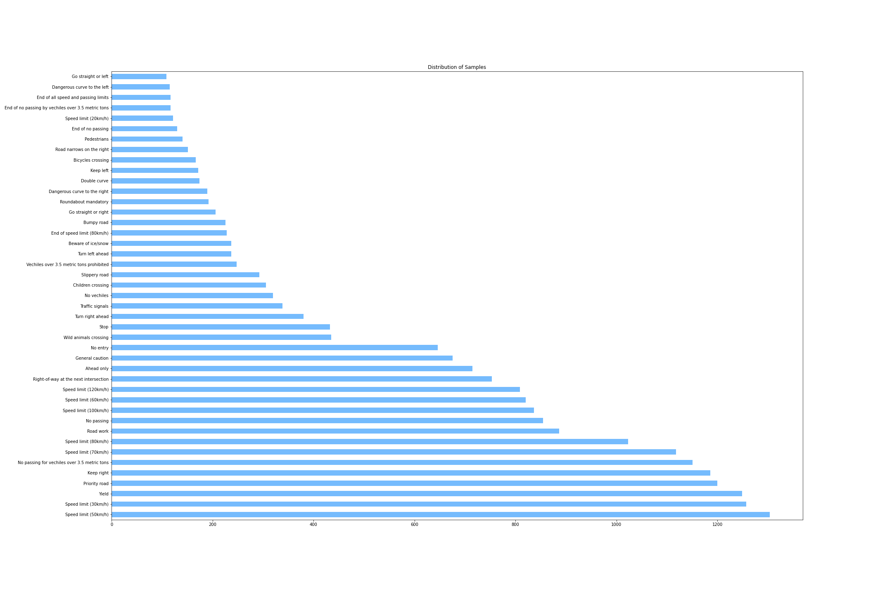
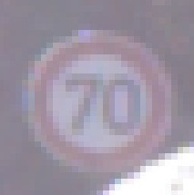
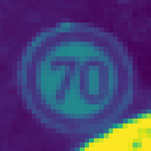
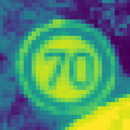
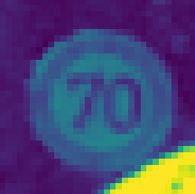
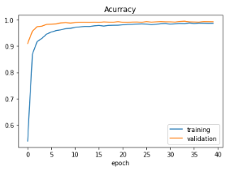
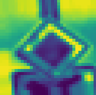
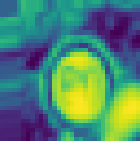
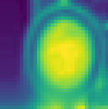

# A Glimpse into Automotive Computer Vision Using Convolutional Neural Networks
Galvanize Capstone Project: A Glimpse into Automotive Computer Vision Using Convolutional Neural Networks

## Objective
The objective of this project is to introduce the field of computer vision and how it is implemented in smart cars. It won't be long until we all have a vehicle with some type of smart technology in it and it would be nice if everyone has a basic understanding of what goes on in the brain of their car. 

## Understanding the Motivation 
[Computer Vision](https://www.ibm.com/topics/computer-vision) is a field of Artificial Intelligence that enables computers and systems to extract meaningful information from images, videos, and other visual inputs.

I'm choosing the automotive industry because over the years, as you can see consumer confidence in self-driving cars has slowly picked up. This is probably because of the advancements in sensor technology and the refinement of Data Science techniques. 

This project will showcase one of those techniques, the Convolutional Neural Network, and how it can be used for image classification in relation to the requirements of smart automobiles. 

## Data 
### Datasets Origin
The data is from the [German Traffic Sign Recognition Benchmark](https://www.kaggle.com/meowmeowmeowmeowmeow/gtsrb-german-traffic-sign) dataset hosted on Kaggle.

### Data
The structure of the data is a directory of 40 classes of traffic sign image directories, where each directory class contains different images of a particular sign for a total of over 50,000 images. This directory can be described as a single-image, multi-class classification dataset.

Excerpt of the data frame:

Infographic of all classes and their corresponding sign. 

### Data Distribution
Here is a distribution of the training data after the `train_test_split`.

As you can see it is extremely imbalanced. To counter this imbalance, I augmented our dataset with pseudo-new images.

### Data Augmentation
In a perfect world, I would have enough of each class of images (each unique sign) that I wouldn't need to balance the dataset. Since that is not the case, I balanced the dataset by generating new images. I chose to augment the data through resizing, grayscaling, equalization, and normalization. These small changes to copies of the data let me count them as different images. 

## Convolutional Neural Network
#### Koala
To run our model I used a Convolutional Neural Network (CNN). The basic understanding of how a CNN works can be illustrated from this diagram taken from a [youtube video by CodeBasics](https://www.youtube.com/watch?v=zfiSAzpy9NM&t=739s).

The aim of neural networks in general is to mimic the decision-making process of animals. In this case, the decision we are making is how to classify what animal is in the image; a koala. If we already know what a koala is we may think that we're simply associating a name to a representation we know, however, we can break down our thought process into finer detail. This finer detail is what we translate into our CNN.

When we see a koala we don't instantaneously make the decision that it's a koala. We breakdown the image and look at it in chunks to answer these questions: 

* This subsection, "Is it koala eyes?"
* This subsection, "Is it a koala nose?"
* This subsection, "Is it koala ears?"
* This subsection, "Is it koala hands?"
* This subsection, "Is it koala legs?"

If so, then we can reassemble the first three features to say that is a koala head. The last two features to say that is a koala body. Then reassemble again to say, this combination of koala head and koala body must be a koala; this image is classified as a koala. 

#### Traffic Signs
We do the same thing with each image of our traffic signs. Our CNN goes over each unique image and breaks it down into chunks and tries to find its own rules for what makes a certain sign that sign. For example, for a 70km/hour sign, when broken down, what makes the top horizontal line of the 7, the loop of the 0. The CNN uses multiple images of each class to make rules that can differentiate between each unique sign. These rules will all be what make up our final model. 

## Our Model

## Results
The results of the model are shown in the table below:

 

|  | Loss | Accuracy |
| :--: | :--: | :----: |
| CNN | 0.0514 | 0.9842 |

<!--  -->

## Burdens of This Project
There is one major pitfall to this project which leads to the "misclassification" of some of the signs. Misclassification is in quotes because even though the predictions are incorrect, according to the training data, the model is predicting exactly how it should.

The problem originates in the data augmentation step. Sometimes images are generated that even a human cannot confidently identify, so the likelihood that our model can differentiate those augmented images from one another is slim.

## Wrap-Up
### Solutions
The main solution to this problem of ambiguous augmented images would be to skip the Augmentation Step entirely. 

To do this we need an already balanced dataset. Since we'll have to get more images, it would also make sense to update our standards for each image. When forming the new more high-quality balanced dataset the best things to keep in mind are: 

* Higher Quality Data / Cameras
    - The data used is from a 2011 dataset when a camera's picture quality were lackluster in comparison to today's standards. Higher quality images will let our model be able to draw out more descriptive qualities.
* Increased Training Time / Better Computational Power
    - This model was ran under a time constraint with a relatively small dataset. In our model we also had to resize the input image to satisfy the time/computational power constraints which limits the amount of information our model can learn. With weeeks/months the model we would generate would be a lot more robust. The top automobile companies would most probably have weeks/months/years to generate highly robust models based on big-data level datasets. 

### Conclusion
This project was more of a proof-of-concept to teach people how their smart cars identify the objects that they see and how it relates to animals' decision-making process. With a simple convolutional neural network we were able to achieve a 98% accuracy against the test set. 

### Future - Steps

* Object Recognition Project : In Progress
* Image Classification : ✅
* Object Localization : In Progress
* Object Detection : In Progress

* Phone App / Demo
  * Using a phone that is rested on a car's dashboard, this app will be able to use everything above to demonstrate the full computer vision that a smart-car utilizes.

